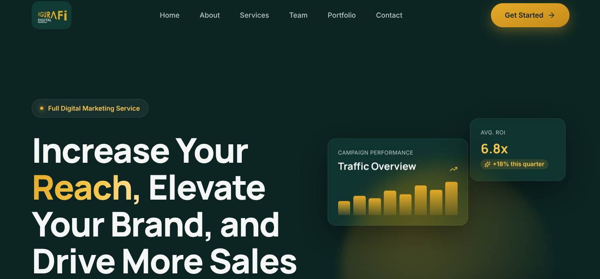
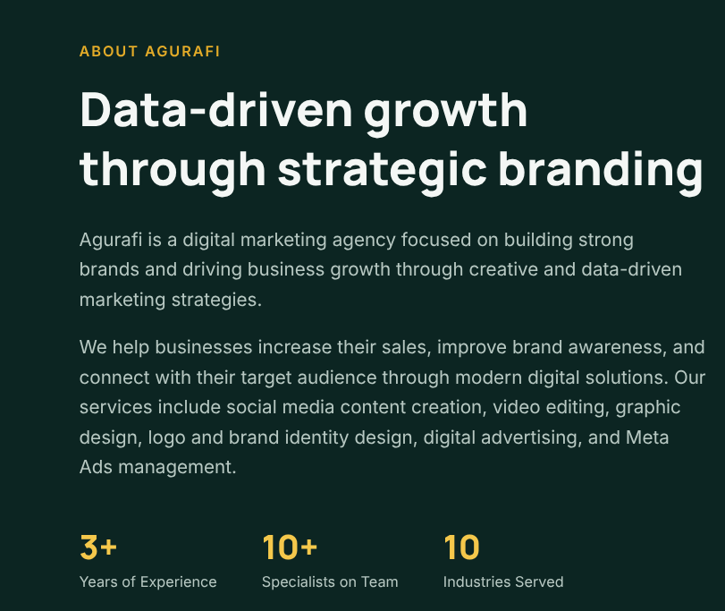

# Agurafi Company — Official Landing Page

---

A modern, high-performance corporate landing page built for **Agurafi Company**, showcasing its core services, solutions, and brand identity through a clean and responsive user interface.

---

## 📸 Website Preview

  

_Responsive desktop and mobile previews of the Agurafi Company landing page._

---

## ✨ Project Highlights

- **Modern UI/UX** — Clean layouts, polished typography, and smooth interactions.
- **TypeScript** — Fully typed React components for maintainable code.
- **Tailwind CSS** — Utility-first styling for a consistent and responsive design.
- **Responsive Design** — Optimized for mobile, tablet, and desktop screens.

---

## 🛠️ Tech Stack

- **Framework:** Next.js (React)
- **Language:** TypeScript
- **Styling:** Tailwind CSS
- **Icons:** Lucide React

---

## 👨‍💻 Developed By

**Bereket Ketema**
_Lead Front-End Developer_

---

## 📄 License & Rights

© Agurafi Company. All rights reserved.
Built and designed by **Bereket Ketema**.
